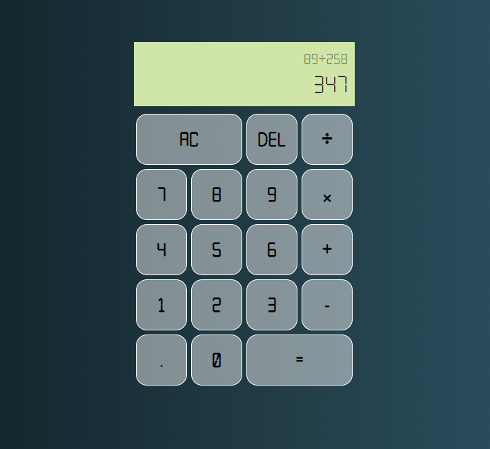

# Basic calculator in react


Proyecto de una calculadora básica, programada en React.js!

## Instalación

Debe tener instalado Node, posterior a ello, solo debe ejecutar los siguientes comandos en la consola en el mismo orden.

```npm install```

## Ejecución

Para ejecutar el proyecto, solo debe ingresar en la terminal

```npm start```
