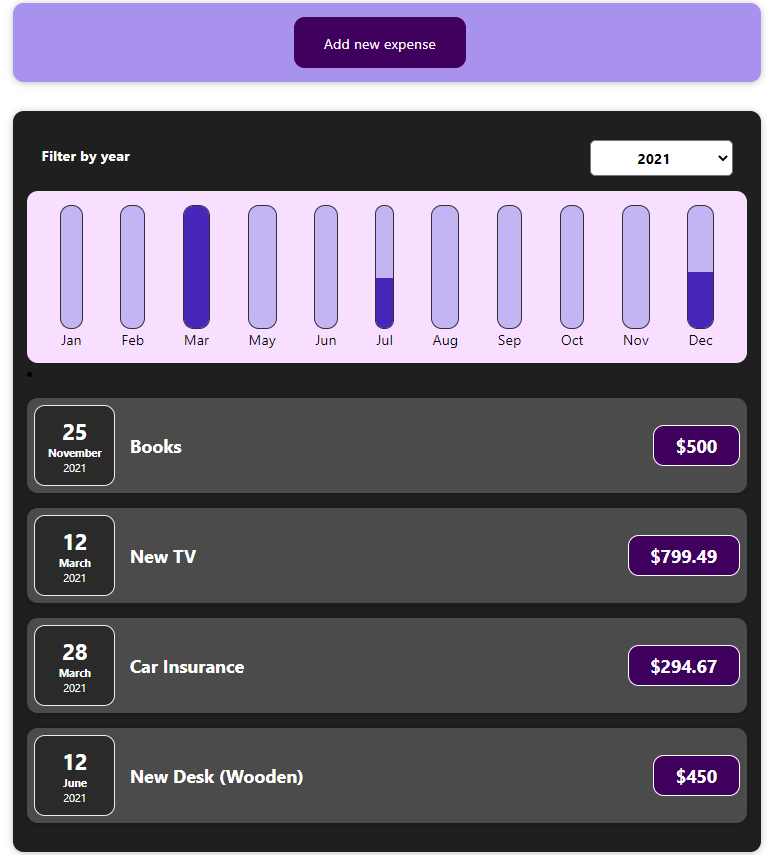

# Expense-Tracker-React


Proyecto de un Expense-Tracker, programada en React.js! Basado en el curso "React - the complete guide (incl hooks, React Router, Redux)" de Academind en Udemy

## Instalación

Debe tener instalado Node, posterior a ello, solo debe ejecutar los siguientes comandos en la consola en el mismo orden.

```npm install```

## Ejecución

Para ejecutar el proyecto, solo debe ingresar en la terminal

```npm start```
